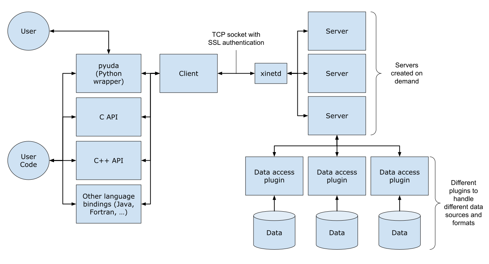
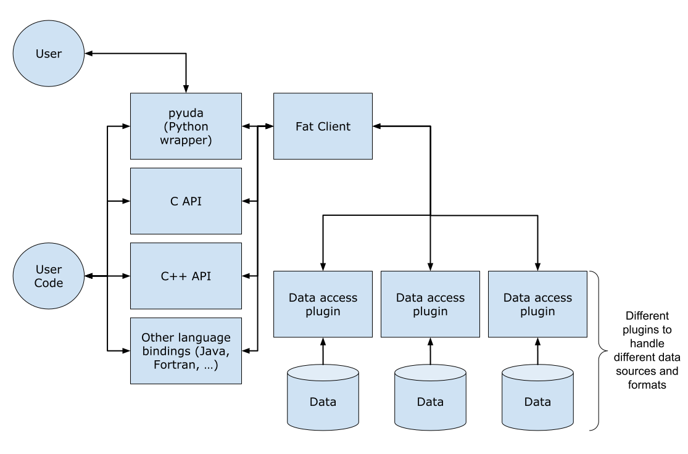

UDA (Universal Data Access) is a client-server infrastructure designed to enable
the reading and passing of heterogeneous data format back to a client in a
universal data format.

## Architecture

The architecture can be seen in the figure below and is described in more
detail in the sections below. UDA exists in both a client-server and fat-client
forms. The client-server form allows for remote servers to be connected to
over TCP sockets, whereas the fat-client form requires the data to be accessible
from the locally run plugins.

UDA supports SSL certificate based authentication.

### UDA architecture

### UDA fat-client architecture

### Server

The server runs behind [xinetd](https://linux.die.net/man/8/xinetd) which handles
load balancing and creation of UDA server processes on demand. Each client socket
connection is paired with a new UDA process, with that process living until the client
socket is closed or until the server times out.

### Plugins

The server (or fat-client) dynamically loads a set of plugin libraries during
initialisation. These plugins define the functionality available to server to
handle data access requests.

### Client

The client is responsible for passing the user data request to a remote server
and making the returned data available.

### Fat-client

The fat-client is a combination of the client and server code and handles the
data access request using locally available plugins instead of passing the request
to a remote server.

## Installing

Information about installing a UDA client (including the pyuda Python wrapper)
can be found [here](client_installation).

Information about installing and configuring a UDA server can be found
[here](server_installation).

## Development

Information about developing new plugin functionality can be found 
[here](creating_plugins).

Information about general development of the UDA code can be found
[here](development).